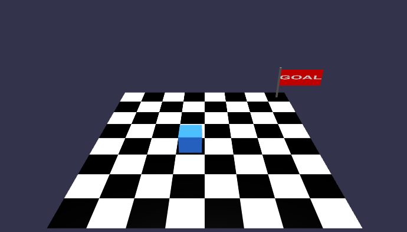

# Deno Sandbox Game 🎮

A programming puzzle game built with **Fresh**, **Babylon.js**, and **Deno
Sandbox API**. Write code to control the character and reach the goal!



## 🚀 Features

- **Interactive Coding**: Write JavaScript/TypeScript code in the browser using
  Monaco Editor.
- **Secure Execution**: User code is executed safely using the
  [Deno Sandbox API](https://docs.deno.com/deploy/api/compression/).
- **3D Visualization**: Watch your code come to life with Babylon.js.
- **Modern Stack**: Built with Deno, Fresh, and Tailwind CSS (DaisyUI).

## 🛠️ Tech Stack

- [Deno](https://deno.com/) - A modern runtime for JavaScript and TypeScript.
- [Fresh](https://fresh.deno.dev/) - The next-gen web framework.
- [Babylon.js](https://www.babylonjs.com/) - A powerful, beautiful, simple, and
  open game and rendering engine.
- [Monaco Editor](https://microsoft.github.io/monaco-editor/) - The code editor
  that powers VS Code.
- [DaisyUI](https://daisyui.com/) - The most popular component library for
  Tailwind CSS.

## 🏁 Getting Started

### Prerequisites

- Install [Deno](https://docs.deno.com/runtime/getting_started/installation).

### Installation & Run

1. Clone the repository:

```bash
git clone https://github.com/Octo8080X/deno-sandbox-api-test.git
cd deno-sandbox-api-test
```

2. Start the development server:

```bash
deno task dev
```

## 🎮 How to Play

1. Look at the game view on the left.
2. Write code in the editor on the right to move the character.
   - Available commands: `moveRight()`, `moveLeft()`, `moveUp()`, `moveDown()`
3. Click **"Run Code"** to execute your plan.
4. Reach the goal flag to win!

## 📄 License

MIT

---

Built with ❤️ using Deno.

<a href="https://fresh.deno.dev">
  
</a>
